```mermaid
graph LR
    A[💡 Idea] -->|Research| B[📋 Planning]
    B -->|Design| C[🎨 UI/UX]
    C -->|Code| D[⚡ Development]
    D -->|Test| E[🧪 Testing]
    E -->|Deploy| F[🚀 Production]
    F -->|Monitor| G[📊 Analytics]
    G -->|Iterate| A
    
    style A fill:#00D9FF,stroke:#0099CC,stroke-width:2px,color:#000
    style B fill:#00D9FF,stroke:#0099CC,stroke-width:2px,color:#000
    style C fill:#00D9FF,stroke:#0099CC,stroke-width:2px,color:#000
    style D fill:#00D9FF,stroke:#0099CC,stroke-width:2px,color:#000
    style E fill:#00D9FF,stroke:#0099CC,stroke-width:2px,color:#000
    style F fill:#00D9FF,stroke:#0099CC,stroke-width:2px,color:#000
    style G fill:#00D9FF,stroke:#0099CC,stroke-width:2px,color:#000
```

<div align="center">
  
</div>

<div align="center">
  
</div>

<h1 align="center">
  
</h1>

<h3 align="center">Python Developer | AI/ML Enthusiast | Android + Web Developer | Founder @ KodeNeurons</h3>

<p align="center">
  
  
  
</p>

<p align="center">
  <strong>🚀 Final Year B.Tech CSE Student | Building Intelligent Systems | Turning Ideas into Impact</strong>
</p>

<p align="center">
  <a href="https://shoyeb.kodeneurons.tech/"></a>
  <a href="https://www.linkedin.com/in/shoyeb-chaudhari-033b44234"></a>
  <a href="/cdn-cgi/l/email-protection#82e1eae3f7e6eae3f0ebf1eaedfbe7e0c2e5efe3ebeeace1edef"></a>
</p>

---

## 👨‍💻 About Me


```python
class ShoyebChaudhari:
    def __init__(self):
        self.name = "Shoyeb Chaudhari"
        self.role = "Python Developer | AI/ML Learner | Founder @ KodeNeurons"
        self.location = "Aurangabad, Maharashtra, India"
        self.education = "B.Tech in Computer Science Engineering"
        self.currently_learning = ["AI/ML", "Advanced Android", "Cloud Technologies"]
        self.fun_fact = "Curiosity + Coffee = Problem Solved! ☕"
    
    def say_hi(self):
        print("Thanks for visiting! Let's build something amazing together! 🚀")

me = ShoyebChaudhari()
me.say_hi()
```

🔹 **Passionate Developer** building intelligent systems and impactful digital solutions  
🔹 **Founder of KodeNeurons** — transforming ideas into reality through code  
🔹 **AI/ML Explorer** — diving deep into machine learning and intelligent applications  
🔹 **Android & Web Enthusiast** — creating seamless user experiences  
🔹 **Leader & Mentor** — Best Event In-Charge at INNOHACK 2025  

<div align="center">
  
</div>

---

## 🔄 My Development Workflow

<div align="center">


</div>

---

## 🔄 My Development Workflow



<div align="center">
  
</div>  

---

## 🛠️ Tech Stack & Skills

<p align="center">
  
</p>

### 🔗 My Tech Stack Flow (n8n Style)

```mermaid
graph TD
    Start[🎯 Project Start] --> Frontend[🎨 Frontend Layer]
    Start --> Backend[⚙️ Backend Layer]
    Start --> Mobile[📱 Mobile Layer]
    
    Frontend --> HTML[HTML5]
    Frontend --> CSS[CSS3/Tailwind]
    Frontend --> JS[JavaScript]
    Frontend --> React[React.js]
    
    Backend --> Python[Python]
    Backend --> Flask[Flask/Django]
    Backend --> API[REST APIs]
    Backend --> DB[(MongoDB)]
    
    Mobile --> Android[Android Studio]
    Mobile --> Java[Java/Kotlin]
    Mobile --> Firebase[Firebase]
    Mobile --> XML[XML Layouts]
    
    Python --> ML[🤖 AI/ML]
    ML --> TF[TensorFlow]
    ML --> SK[scikit-learn]
    ML --> Data[Pandas/NumPy]
    
    React --> Deploy[🚀 Deployment]
    API --> Deploy
    Android --> Deploy
    
    Deploy --> Git[Git/GitHub]
    Git --> Cloud[☁️ Cloud/Server]
    
    style Start fill:#00D9FF,stroke:#0099CC,stroke-width:3px,color:#000
    style Frontend fill:#E34F26,stroke:#C13525,stroke-width:2px
    style Backend fill:#3776AB,stroke:#2E5F8A,stroke-width:2px
    style Mobile fill:#3DDC84,stroke:#2FB570,stroke-width:2px
    style ML fill:#FF6F00,stroke:#CC5900,stroke-width:2px
    style Deploy fill:#00D9FF,stroke:#0099CC,stroke-width:3px,color:#000
```



<div align="center">
  
</div>

### 📱 Mobile Development


### 🌐 Web Development


### 🤖 AI/ML & Data Science


### 🗄️ Databases & Tools


---

## 📊 GitHub Analytics

<div align="center">
  


</div>

### 📈 Contribution Activity

[](https://github.com/ShoyebChaudhari45)

---

## 🏆 Achievements & Certifications

<div align="center">

| Achievement | Details |
|------------|---------|
| 🥇 | **Best Event In-Charge** – INNOHACK 2025 |
| 🚀 | **Submission** – Bhartiya Antariksh Hackathon 2025 |
| 🏆 | **Winner** – AI & Security Day Hackathon |
| 📜 | **J.P. Morgan** – Software Engineering Job Simulation |
| 📜 | **Accenture** – Data Analytics and Visualization Job Simulation |
| ✅ | **Certificate of Participation** – AI and Security Day |

</div>

---

## 💼 Professional Experience

### 🚀 **KodeNeurons** | Founder & Software Developer
*Jan 2025 - Present*
- Founded and lead a student-driven tech venture focused on innovative Android and web applications
- Designed and deployed custom Android apps using Java, XML, Firebase, and third-party APIs
- Led team of developers managing timelines, task distribution, and quality assurance
- Integrated AI/ML features for smart functionality using Python and TensorFlow Lite

### 💻 **Mountreach Solution Pvt. Ltd.** | Software Developer
*June 2025 - Present*
- Developing scalable software solutions and managing full-stack projects

### 🔧 **Idyllic Services** | Associate Developer Intern
*Jan 2026 - Present*
- Working on cutting-edge development projects and learning industry best practices

---

## 🤖 AI/ML Project Pipeline

```mermaid
graph TB
    Data[📊 Data Collection] --> Clean[🧹 Data Cleaning]
    Clean --> EDA[🔍 Exploratory Analysis]
    EDA --> Feature[⚙️ Feature Engineering]
    Feature --> Split[📂 Train/Test Split]
    Split --> Model[🧠 Model Training]
    
    Model --> Algo1[🌲 Random Forest]
    Model --> Algo2[🎯 Neural Networks]
    Model --> Algo3[📈 Gradient Boosting]
    
    Algo1 --> Eval[📊 Model Evaluation]
    Algo2 --> Eval
    Algo3 --> Eval
    
    Eval --> Tune[🎛️ Hyperparameter Tuning]
    Tune --> Deploy[🚀 Deployment]
    Deploy --> Monitor[📡 Monitoring]
    Monitor --> Feedback[🔄 Feedback Loop]
    Feedback --> Data
    
    style Data fill:#00D9FF,stroke:#0099CC,stroke-width:2px,color:#000
    style Model fill:#FF6F00,stroke:#CC5900,stroke-width:3px
    style Eval fill:#4CAF50,stroke:#388E3C,stroke-width:2px
    style Deploy fill:#00D9FF,stroke:#0099CC,stroke-width:3px,color:#000
```



<div align="center">
  
</div>

---

## 🎯 Currently Working On

<div align="center">
  
</div>

- 🤖 Building AI-powered mobile applications
- 🌐 Developing full-stack web solutions with modern frameworks
- 📊 Exploring advanced machine learning algorithms
- 🔥 Contributing to open-source projects

---

## 💡 What Drives Me

> *"The thrill of turning code into something useful, beautiful, and scalable — whether it's an app, a system, or an AI model."*

I combine **creativity**, **logic**, and **empathy** to build technology that matters. From Android apps to AI models, I'm always pushing boundaries and learning something new.

---

## 🤝 Let's Connect & Collaborate

### 🌐 Collaboration Flow


<div align="center">
  
</div>

I'm actively looking for:
- 🎯 **Internship or freelance opportunities** in Android, Web, or ML
- 🤝 **Collaborations** on innovative student/startup projects
- 👨‍🏫 **Mentors** who can guide me to grow technically and professionally

<p align="center">
  <strong>Whether you're hiring, collaborating, or just curious — I'd love to talk tech! 🚀</strong>
</p>

<p align="center">
  <a href="https://shoyeb.kodeneurons.tech/">
    
  </a>
  <a href="/cdn-cgi/l/email-protection#5a39323b2f3e323b2833293235233f381a3d373b333674393537">
    
  </a>
</p>

---

<p align="center">
  <img src="https://capsule-render.vercel.app
